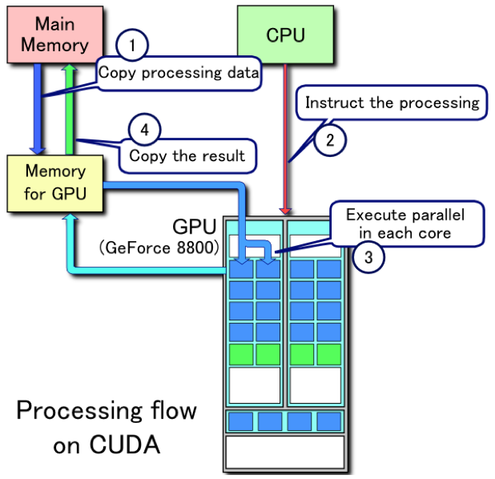
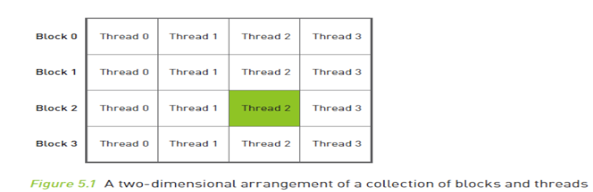

# Thinking in basics.

## Objective

1.Write first CUDA application.

2.Start thinking in“CUDA way”.

3.Measure CUDA performance.

4.Compare CUDA to Java.

## Dip dive

I’m fan of dip dive, so lets start our journey by writing our first project.

Before I go to CUDA I always create prototype in Java \(sometimes in C\), there are two obvious gains from that:

-there is working solution in Java where you can compare speed and see if your CUDA implementation is working

-you can write proper tests to compare output of Java and CUDA, to make sure that your translated algorithm produces exactly the same output - yes, yes, even implementation of CUDA float could be different to C/Java so simple calculations could produce quite different output

But before we will create our Java model - lets look into very simple CUDA solution, so we could get the feeling how to write in Java so it will be easily translate and will have quite similar characteristic.

Lets define our problem:

-we have database of stations - each station contains set of fingerprints, each fingerprint has information about measure and what geolocation this measure represent

-we have stream of information about active cells each of them has current information about visible stations and latest measurement value

-output of this should be closest geolocation based on cell measurement and stations data

Usage of CUDA takes 4 steps as was visible in first picture:

1\)Prepare input data and copy them to CUDA memory

2\)Copy kernel code - processor instructions

3\)Run kernels

4\)Copy back output data

Lets start our implementations with brute force solution.

## BRUTE FORCE

Why brute-force? It’s easy and from beginning you can see power of CUDA.

In CUDA you almost have no structures, so whatever you working on are basically arrays. You can have 1/2/3/4 -dimensional arrays and later we will see gov and why to use them.

As I’m using jCuda - first I need to prepare structures in Java then move them to GPU, compute and get results.

### Cuda side

There are few points that need to be told:

-CUDA is simplified/ basic C

-access to arrays is by pointers - as so CUDA don’t have knowledge about array sizes

-there are some magic values in CUDA:

`blockIdx.x*blockDim.x + threadIdx.x = current thread number`

> **!!! THIS IS MOST IMPORTANT FEATURE OF CUDA !!!**
>
> **Instead going through loop - here you are allowing each processor to get it’s own element and work on them in parallel!**

GPUs has lots of processors that are working in same time on same data and this is the method to get current processor ID inside block \(WARP\)

This has 3 dimensions:

`blockIdx.y*blockDim.y + threadIdx.y`

`blockIdx.z*blockDim.z + threadIdx.z`

To use additional dimensions you need to initialise them during kernel preparation.

There are different number of threads to use on each dimensions.

-CUDA works on WARPs \[32 processors parallel\] in same time - that’s why we have“if \(x&lt;numCells\)”- if input data will not be divided by 32 - it will try to calculate values outside of scope and changing some random values

### JAVA

On Java side we will have:

#### Initialization

`// Enable exceptions and omit all subsequent error checks`

`JCudaDriver.setExceptionsEnabled(true);`

`// Initialize the driver and create a context for the first device.`

`cuInit(0);`

`CUdevice device = new CUdevice();`

`cuDeviceGet(device, 0);`

`CUcontext context = new CUcontext();`

`cuCtxCreate(context, CUctx_flags.CU_CTX_SCHED_BLOCKING_SYNC, device);`

Initialise and create CUDA context - here using device 0 - this is first GPU on box - if there are more GPUs they will have another ids \(1,2,…\)

#### Kernel code

`//USE the PTX file by calling the NVCC`

`String ptxFileName = "JCudaGeolocation.ptx";`

`// Load the ptx file.`

`CUmodule module = new CUmodule();`

`cuModuleLoad(module, ptxFileName);`

`// Obtain a function pointer to the "score" function.`

`CUfunction function = new CUfunction();`

`cuModuleGetFunction(function, module, "finder");`

To use CUDA code that we saw on first listing we need to comply them.

There are few options to do it:

-on the fly using NVCC complier

-create PTX file - is something like java class files where your cade could be run on different type of graphics cards

-create cubin file - executable file for specific graphic card

### Time measurement

Before we go further - few seconds on how to measure timings on CUDA.

To measure timings CUDA uses events - as lots of GPU/CPU interaction happens in asynchronous way CUDA gives us possibility to get event“timestamp”when something happen after all previous GPU connected activities finish. IE: if we will record event after loading CUDA module, we are just pointing what CUDA should do at the moment, and whole load stuff could happen few ms later when on CPU side we will be doing totally different things.

To measure timings on CUDA side I’ll use this structure:

`CUevent cuStart = new CUevent();`

`cuEventCreate(cuStart,0);`

`cuEventRecord(cuStart, null);`

`////////// CODE TO BE MEASURED`

`//////////…..`

`//////////…..`

`CUevent cuEnd = new CUevent();`

`cuEventCreate(cuEnd,0);`

`cuEventRecord(cuEnd, null);`

`cuEventSynchronize(cuEnd);`

`float[] pMilliseconds = new float[1];`

`cuEventElapsedTime(pMilliseconds , cuStart, cuEnd);`

`LOG.info("@@ TIMINGS::"+ pMilliseconds[0]+"ms");`

To provide proper time measurement we need to use 2 events.

Time is measured in moment of execution of cuEventRecord.

Second parameter is stream id, if is null means is main stream \[more about streams and streams usage later\].

To measure time it needs to be synchronised by call to cuEventSynchronize - it need to be only once on last recording - before you want to actually print time.

#### Structure preparation

As mentioned - whole structure must be prepared properly on java side as plain arrays.

After that they could be copied to GPU memory by :

-creating pointers,

-allocating memory,

-and physically copying values.

#### Kernel call

When data is prepared there is time for calling kernel.

There are two steps here

-create kernel parameter pointer - where we put pointers to all parameters of our main CUDA function

-launch kernel with additional setup for grid/block sizes

Block size need to be \* WARP, while WARP is 32, test with \[1024 max!\].

For more information about how to properly setup block sizes see Occupancy Calculator

[https://devtalk.nvidia.com/default/topic/368105/cuda-occupancy-calculator-helps-pick-optimal-thread-block-size/](https://devtalk.nvidia.com/default/topic/368105/cuda-occupancy-calculator-helps-pick-optimal-thread-block-size/)

However is good to do our own tests as usage /timings is highly dependent on algorithm.

Here some of our outputs:

`* 8438 items, size 256 => 2515ms`

`* 8438 items, size 512 => 2406ms`

`*8438 items, size 768 => 2306ms`

`* 8438 items, size 1024 => 2315ms`

`* 7857 items, size 256 => 1958ms`

`*7857 items, size 512 => 1947ms`

`* 7857 items, size 768 => 2293ms`

`* 7857 items, size 1024 => 1951ms`

`private static final int CUDA_BLOCK_SIZE = 512; //suggested value`

#### Output copy

This is very similar to our input data, only direction if opposite - DtoH - from Device to Host:

`cuMemcpyDtoH(Pointer.to(outLat), d_outLat, NUM_MR_TO_LOCATE * Sizeof.FLOAT);`

`cuMemcpyDtoH(Pointer.to(outLong), d_outLong, NUM_MR_TO_LOCATE * Sizeof.FLOAT);`

`cuMemcpyDtoH(Pointer.to(outWeight), d_outWeight, NUM_MR_TO_LOCATE * Sizeof.INT);`

Note: later we will talk about pinned/unpinned memory.

#### Cleaning memory

As we are using C, when we allocate memory we need to free it after use.

`// Clean up.`

`cuMemFree(devicedbCellIDs);`

`cuMemFree(devicedbRscp);`

`cuMemFree(devicedbLat);`

`cuMemFree(devicedbLong);`

`cuMemFree(d_inputMRIdx);`

`cuMemFree(d_inputMRCells);`

`cuMemFree(d_inputMRscps);`

`cuMemFree(d_outLat);`

`cuMemFree(d_outLong);`

`cuMemFree(d_outWeight);`

`cuEventDestroy(cuStart);`

`cuEventDestroy(cuEnd);`

`cuCtxDestroy(context);`

## Output

### CUDA output

For 450.575 input measurements, with stations fingerprint database containing 1.931.302 fingerprints, all calculations on GPU takes 71.139ms = 1 min 11sec 139 ms

### Java output

JAVA version to compare:

I created same structure as for CUDA with separate arrays :

`/*`

`* CALCULATIONS`

`*/`

`for (int x = 0; x < sizeMRs; x++) { // for all measurements`

`for (int y = 0; y < NUM_FPS; y++) { // check all FPs`

`if (inputMRCells[x] == dbCellIDs[y]) { // where cell is same`

`if (Math.abs(dbRscp[y] - inputMRscps[x]) < 0.01) {`

`outLat[x] += dbLat[y];`

`outLong[x] += dbLong[y];`

`outWeight[x]++;`

`}`

`}`

`}`

`}`

For 450.575 input measurements, with stations fingerprint database containing 1.931.302 fingerprints, CPU calculations get 594.334ms = 9min 54sec 334ms

## Summary

As we can see brute force solution gets 10 times quicker on GPU than CPU.

Is this big ? Yes and No.

This is not good algorithm to be applied to that solution, the only advantages that we get from using GPU is fact that instead 1 CPU processor we’ve got 8MPs - 1536 cores working concurrently.

In this solution each processor is going through loop of 2 mln fingerprints.

If you’ll play with trying different approach: i.e.: going through fingerprints and for each of FP loop through 450k measurements - output will be similar.

There could be gain when difference between numbers in 2 databases are significantly bigger. But as we will see later - there other capabilities of GPU that we can use.

Before we go and optimise algorithm lets spend some time researching CUDA capabilities and another future of graphics card that we can use to speed up brute force solution - TEXTURES.

