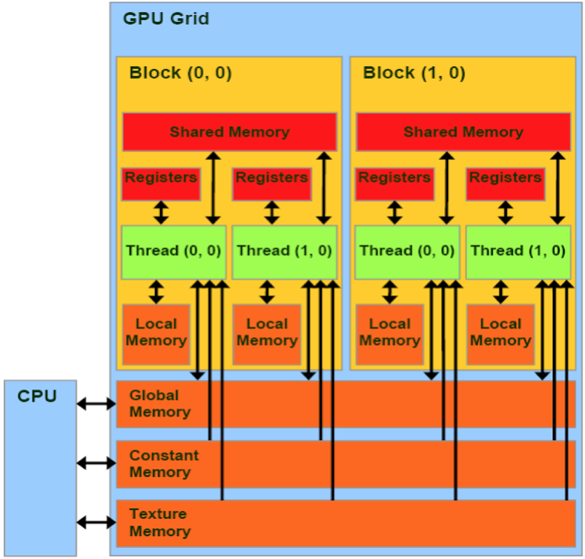

# CUDA capabilities

On picture below you could see all areas of GPU that we potentially could use.

From CPU perspective we could have access to:

-global memory \(unpinned and pinned\)

-constant memory

-texture memory

ON GPU side we additional have access to:

-registers

-local memory

-shared memory

