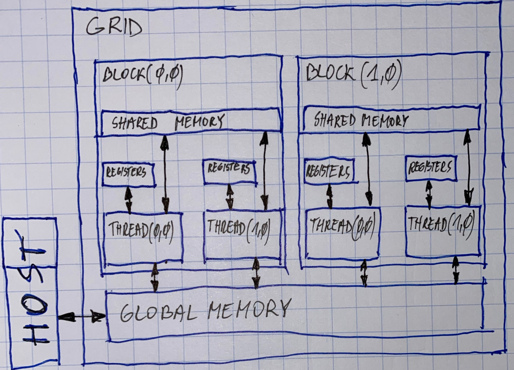

# Memory Model

| Memory | Location, on/off chip | Cached | Access | Scope | Lifetime | Note |
| :--- | :--- | :--- | :--- | :--- | :--- | :--- |
| Register | on | n/a | R/W | 1 thread | thread | no latency, no sharing, TB/s |
| Local | off | &gt;=2.0 | R/W | 1 thread | thread |  |
| Shared | on | n/a | R/W | all threads in block | block | i.e: 64KB per block |
| Global | off | &gt;=2.0 | R/W | all threads + host | host allocation | GBs, cudamemcpy, cudamalloc |
| Constant | off | yes! | R | all threads + host | host allocation | 1500GB/s |
| Texture | off | yes | R  | all threads + host | host allocation |  |

CUDA memory spaces & scopes

* global
* local \(per-thread global memory\)
* shared
* constant
* registers

