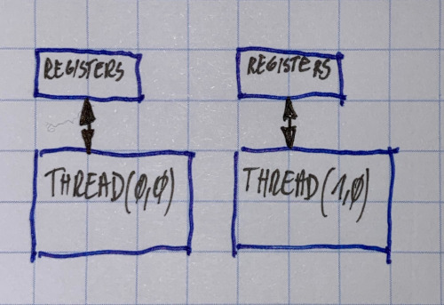

# Regiters

### Registers

Fast region of memory \(fastest\)

Thread local access

Number of 32-bit registers per SM:

* compute capability 1.3: 16K
* compute capability 2.x: 32K


Compiler switch -ptxas="--verbose" shows info about used registers.

--maxregister=N no more than 32 per kernel


