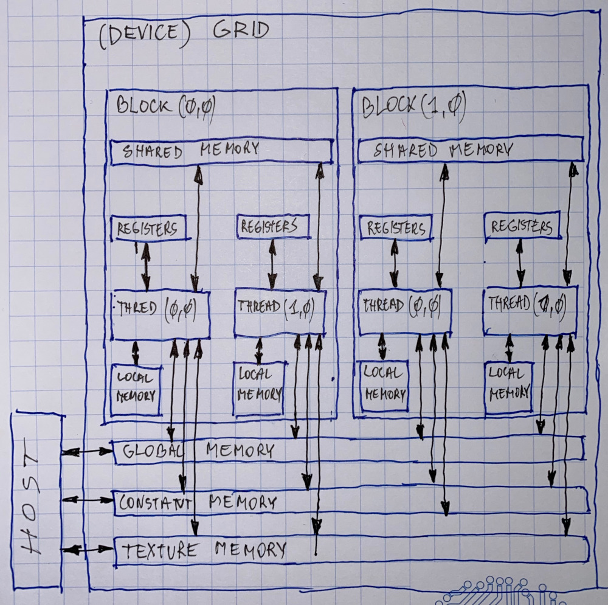

# Tips & tricks

### Tips & tricks

#### Where to declare variables?

#### Variable type restrictions \(OLD\)

Pointers can only point to memory allocated or declared in global memory:

* allocated in the host and passed to the kernel: `__global__ void kernel KernelFunction(float* ptr)`
* obtained as the address of a global variable: `float* ptr = &GlobalVar;`

Since CUDA 4.0 - Unified Virtual Addressing for 64bit OS on CC 2.x overcomes that restrictions - any pointer is allowed.

#### A common programming strategy

Global memory resides in device memory \(DRAM\) - much slower access than shared memory

Profitable way fo performing computation on the device is to **tile data** to take advantage of fast shared memory:

* partition data into subsets that fit into shared memory
* handle each data subset with one thread block by:

  * loading the subset from global memory to shared memory, using multiple threads to exploit memory-level parallelism;
  * performing the computation on the subset from shared memory; each thread can efficiently multi-pass over any data element;
  * copying results from shared memory to global memory;

Constant memory also resides in device memory \(DRAM\) - much slower access than shared memory:

* cached!
* highly  efficient access for read-only data

Carefully divide data according to access patterns:

* R/Only -&gt; constant memory \(very fast if in cache\)
* R/W shared within block -&gt; shared memory \(very fast\)
* R/W within each thread -&gt; register \(very fast\)
* R/W inputs/outputs \(results\) -&gt; global memory \(very slow\)

#### GPU atomic operations

Atomic operations on integers in shared and global memory:

* associative operations on signed/unsigned ints:
  * `atomicAdd()`
  * `atomicSub()`
  * `atomicExch()`
  * `atomicMin()`
  * `atomicMax()`
  * `atomicInc()`
  * `atomicDec()`
  * `atomicCAS()`
* some operations on bits


Starting with compute capability 1.1 for global and 1.2 for shared memory.

atomicAdd\(\) also available for float starting with compute capability 2.0


#### Typical structure of CUDA program

1. Global variables declaration
   * `__host__`
   * `__device__, __global__, __constant__, texture`
2. Function prototypes
   * `__global__ void kernelOne(...)`
   * `float helperFunction(...)`
3. Main \(\)
   * allocate memory space on the device - `cudaMalloc(&d_GlobalVariablePtr, bytes)`
   * transfer data from host to device - `cudaMemCpy(d_GlobalVariablePtr, h_GlobalVariablePointer,..)`
   * execution configuration setup
   * kernell call - `kernelOne<<<execution configuration>>>(args...)`
   * transfer results from device to host - `CudaMemCpy(h_GlobalVariablePtr, d_...)`
   * optional \(in test mode\): compare against golden \(host computed\) solution
4. Kernel - void kernelOne\(type args...\)
   * variables declaration - `__shared__`
   * automatic variables transparently assigned to register or local memory
   * `__syncthreads()...`
5. Other functions

   * `float helperFunction(int intVar...);`

#### CUDA device memory space

Each thread can:

* R/W per thread registers
* R/W per-thread local memory \(avoid\)
* R/W per-block shared memory
* R/W per-grid global memory
* Read only per-grid constantmemory
* Read only per-grid texture memory

The host can:

* R/W global constant and texture memory

