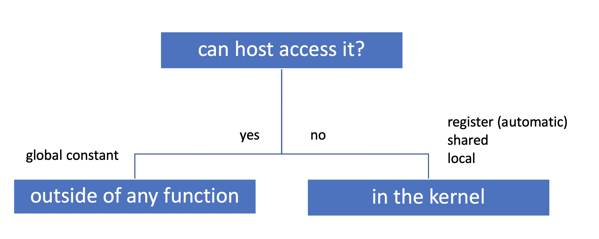

# CUDA Memory Model


| Memory | Location, on/off chip | Cached | Access | Scope | Lifetime | Note |
| :--- | :--- | :--- | :--- | :--- | :--- | :--- |
| Register | on | n/a | R/W | 1 thread | thread | no latency, no sharing, TB/s |
| Local | off | &gt;=2.0 | R/W | 1 thread | thread |  |
| Shared | on | n/a | R/W | all threads in block | block | i.e: 64KB per block |
| Global | off | &gt;=2.0 | R/W | all threads + host | host allocation | GBs, cudamemcpy, cudamalloc |
| Constant | off | yes! | R | all threads + host | host allocation | 1500GB/s |
| Texture | off | yes | R  | all threads + host | host allocation |  |


CUDA memory spaces & scopes

* global
* local \(per-thread global memory\)
* shared
* constant
* registers


### Global memory

Large - depends on card ie: 

* C1060 - 4GB
* C2050 - 3GB
* C2070 - 6GB

Has long latency: ~200 cycles

Can only be allocated/freed by host

Main way host can pass data to/from device/

Allocate, copy, free:

```c
//allocate
cudaError_t cudaMalloc(void **devPtr,size_t size);

//copy
cudaError_t cudaMemcpy(void *dst, const void *src,size_t count, enum cudaMemcpyKind kind);
//kind: type of copy: H->D, D->H, D->H, D->D

//setting data on device
cudaError_t cudaMemset(void *devPtr,int value, size_t count);

cudaError_t cudaFree(void *devPtr);
```


  
Global memory has long latency, there are others:

* shared memory
* constant
* registers


### Registers

Fast region of memory \(fastest\)

Thread local access

Number of 32-bit registers per SM:

* compute capability 1.3: 16K
* compute capability 2.x: 32K


Compiler switch -ptxas="--verbose" shows info about used registers.

--maxregister=N no more than 32 per kernel



### Constant memory

A cached region of global memory

All threads in all blocks can access

64KB capacity, 8KB cache per SM

Cannot be written by device

Can be set by host using cudaMemcpyToSymbol

```c
//device code:
__constant__ float constData[256];

//host code:
fload data[256];
cudamMemcpyToSymbol(constData, data, sizeof(data));
```

Or in the declaration on device:  


```c
//device code:
__caonstant__ float constData[3] = {0.2, 0.666, 0.83};
```


### Shared memory

Fast region of memory

Block-local access

Size per SM:

* compute capability 1.3: 16K
* compute capability 2.x: 16 or 48K

Possible uses:

* storing intermediate values \(ie: accumulators\) before writing to global memory
* to share data with other threads in the block
* use as a cache to avoid redundant global memory access \(CC1.x\)

Usage - fixed size:

```c
#define SIZE 10

__global__ void myKernel(...) {

    ...
    __shared__ int sharedList[SIZE];
    sharedList[0] = ...
    sharedList[1] = ...
}
```

Usage - dynamic size:

```c
//device code:
__global__ void myKernel(...) {
    ...
    extern __shared__ int sharedList[];

}

...
// host code
size_t ns = numElements * sizeof(int);

//kernel call
myKernel<<grid,block, ns>>>(...);

```


### Textured memory


Texture cache, one per multiprocessor - originally for storing images to give illusion of textured object.

Whan item is read from global memory it is stored on the texture cache.

Allows subsequent readts to utilise this element rather than calling globel memory or constant memory.

Texture memory is NOT kept constant with global memory writes - a write to such address in the same kernel call will return undefined data when read again.

Texture memory is :

* an unusual combination of cache \(separate from registe, global, and shared memory\) and local processing capability - separate from the scalar processors.
* data is stored .in the device global memory, but it is accessed through texture cache - useful for caching \(coalescing is a problem\)
* support linear/bilinear and trilinear hardware interpolation \(graphics\)
* bound to linear memory \(1D problems only\)
* bound to CUDA arrays \(1D, 2D, 3D problems, hardware interpolation\)
* read only, cannot detect dirty data - co cache consistency


 

```c
// declare texture reference
texture<float,1,cudaReadMOdeElementType> texreference;
//must be global on main program
// type, dimension, 

int main(int argc, char** argv) {
    int size=3200;
    float* harray;
    float* diarray;
    float* doarray;
    
    //allocate host and device memory
    harray = (float*) malloc(sizeof(float)*size);
    cudaMalloc((void**) &diarray, sizeof(float)*size);
    cudaMalloc((void**) &doarray, sizeof(float)*size);
    
    //initialize host array before usage
    for(int loop = 0; loop<size; loop++) 
        harray[loop]=(float)rand()(RAND_MAX-1);
    
    //copy array from host to device memory:
    cudaMemcpy(diarray,harray,sizeof(float)*size, cudaMemcpyHostToDevice);
    
    //bind texture reference with linear memory
    cudaBindTexture(0,texreference,diarray, sizeof(float)*size);
    
    //execute kernel
    kernel<<<(int)ceil((float)size/64),64>>>(doarray,size);
    
    //unbind texture reference to free resource
    cudaUnbindTexture(texreference);
    
    //free host and device memory
    free(harray);
    cudaFree(diarray);
    cudaFree(doarray);
    
    return 0;
    
}
```


```c
__global__ void kernel(float* doarray,int size){
    //calculate each thread global index
    int index = blockIdx.x*blockDim.x+threadIdx.x;
    
    //fetch global memory through texture reference
    doarray[index] = tex1Dfetch(texreference, index);

}


__global__ void offsetCopy(float* idata, float* odata, int offset){
    //compute each thread global index
    int index = blockIdx.x*blockDim.x+threadIdx.x;
    
    //copy data from global memory: non-textured
    odata[index]= idata[index+offset];
    
    //copy data from global memory: textured
    odata[index] = tex1Dfetch(texreference,index+offset);
}
```


### Tips & tricks

#### Where to declare variables?




