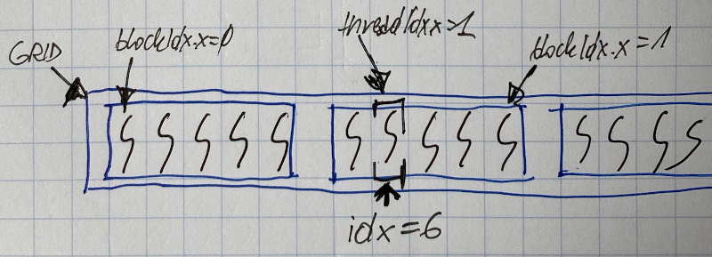

# CUDA Threads

### What is a CUDA Thread

CUDA threads are very lightweight processes - much lighter than usual CPU threads

It is very-low cost to:

* create them \(at kernel launch\)
* schedule them
* destroy them \(at kernel end\)

They are building blocks of any CUDA computation.

Organised per sets called "blocks"

Blocks are further organised on "grids"


### Grids and Blocks

Grids and Blocks are basic CUDA concepts, that permit to organise threads

They are created as kernel launch:

* grids are 1, 2, \(or 3\) dimensional array of blocks
* blocks are 1, 2, \(or 3\) dimensionale array of threads

A thread block is a batch of threads that can cooperate with each other by:

* synchronising their execution using barriers
* efficiently sharing data through a low latency shared memory

Two threads from two different blocks cannot cooperate


### Thread block organisation

Threads are grouped into blocks

Blocks can have 1, 2, or 3 dimensions

Each block dimension can have a maximum number of threads \(e.g. 512, 1024\)


#### Thread block

Block shape doesn't matter, but may be usefull for mapping threads to data


Or mapping nested loops in the original code: each 2D-organised thread taking care of an \(i,j\) pair:


#### Block organisation

Threads are grouped into blocks

Blocks are organised in a grid

A grid can be 1D, 2D \(or 3D\)


### Language extensions: built-in variables


You can use those variables inside kernel code ie: to go through loop 


```c
struct dim3 {int x, y, z}


dim3 gridDim;
// dimestions of the grid in blocks (gridDim.z unused prior to CUDA 4.0)

dim3 blockDim;
// dimensions of the block in threads

dim3 blockIdx;
// block index within grid

dim3 threadIdx;
// thread index within block
```

Example: 1D blocks and grids


Simple Program Multiplt Data - concept!



Example: 2D blocks and grids


#### Computing global thread ID

Global thread ID can be used to decide what data thread will work on




```c
int idx = blockIdx.x * blockDim.x + threadIdx.x
```

Global thread ID can be used to decida what data a thread will work on - reading memory array idx.


#### Thread cooperation


90% of bugs, are due to:


Threads within a block can synchronise

A thread cannot synchronise with threads in other blocks


#### Thread synchronisation

Within a block you can:

* exchange data vie shared memory \(or other\)
* synchronise threads: \_\_syncthreads\(\)


