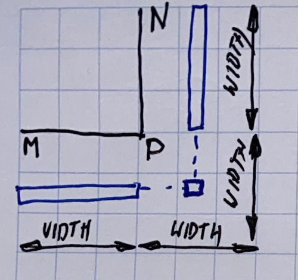
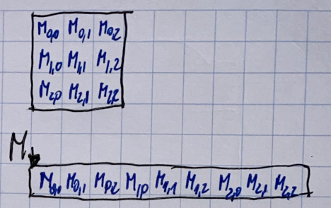
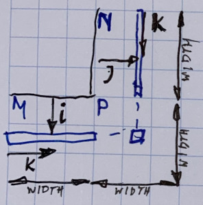
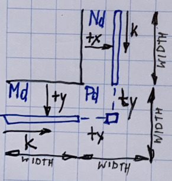
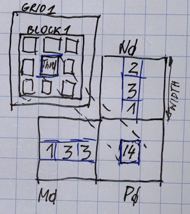

# Matrix multiplication

### Essentials

A kernel is the piece of code executed on the CUDA device by a single CUDA thread.

Blocks and grids may ve 1D, 2D or 3D.

Each thread has access inside the kernel to certain variables that define its position:

```text
gridDim, blockIdx, blockDim, threadIdx
```


### Example: Square matrix multiplicaiton

A simple matrix multiplication example that illustrates the basic features of memory and thread management in CUDA programs:

* local, register usage
* thread ID usage
* memory data transfer API between host and device
* assume square matrix for simplicity
* leave shared memory usage until later




P = M \* N of size WIDTH \* WIDTH

Without tiling:

* one thread calculates one element of P
* M and N are loaded WIDTH times from global memory


#### Memory layout on matrix in C




#### Step 1: Simple host version in C


```c
// matrix multiplication on CPU - host
void MatrixMultHost(float* M, float* N, float* P, int WIDTH) {
    for(int i = 0; i < WIDTH; ++i) {
        for(int j = 0; j < WIDTH; ++j) {
            double sum = 0;
            for(int k = 0; k < WIDTH; ++k) {
                double a = M[i * WIDTH + k];
                double b = N[k * WIDTH + j];
                sum += a * b;
            }
            P[ i * WIDTH + j] = sum; 
        }
    }
}
```



#### Step 2: Input data transfer

```c
void MatrixMultDevice(float* M, float* N, float* P, int WIDTH) {
    int size = WIDTH * WIDTH * sizeof(float);
    float* Md,Nd,Pd;
    //...
    //alocate and load M,N to device memory
    cudaMalloc(&Md, size);
    cudaMemcpy(Md,M, size, cudaMemcpyHoatToDevice);
    
    cudaMalloc(&Nd, size);
    cudaMemcpy(Nd, N, size, cudaMemcpyHostToDevice);
    
    //allocate P on the device
    cudaMalloc(&Pd, size);    
}
```


Lines 6,9,13 - this is double pointer

cudaMemcpyHostToDevice means move from CPU \(global memory\) to GPU mamory

After line 13 - there is no copy as this is just allocation of output memory \(see next\)



#### Step 3: Output data transfer

```c
    // kernel invocation
    //...
    
    //read P from device
    cudaMemCpy(P, Pd, size, cudaMemcpyDeviceToHost);
    
    //free device memory (matrices)
    cudaFree(Md);
    cudeFree(Nd);
    cudaFree(Pd);
}
```



line 5 - as this is "move back" to CPU code - P and Pd here are on different paces


#### Step 4: Kernel function


```c
//matrix multiplication - kernel
__global__ void MatricMultKernel(float* M, float* N, float* P, int WIDTH) {
    //pval is used to store the element of the matrix computed by the thread
    float pval = 0;
    
    for (int k = 0; k < WIDTH; ++k) {
        float elementM = Md[threadIdx.y * WIDTH + k];
        float elementN = Nd[k*WIDTH + threadIdx.x];
        pval += elementM * elementN;
    }
    
    Pd[threadIdx.y * WIDTH +threadIdx.x] = pval;
}
```


in kernel code you cannot see i,j as they are "removed" by parallel threads \(done automagically\)

elementM, elementN  are local registers 

line 12 =&gt; Single Program Multiple Data





#### Step 5: Kernel Invocation

```c
    //setup the execution configuration
    dim3 dimGrid(1,1);
    dim3 dimBlock(WIDTH, WIDTH);
    
    //launch the device computation threads
    MatrixMultKernel<<<dimGrid,dimBlock>>>(Md, Nd, Pd, WIDTH);
    
```


line 2 - only one block will be used

line 3 - number of threads in block equals our outpput matrix



What is going on?




One block of threads to compute matrix Pd = each thread computes one element of Pd.

Each thread:

* loads a row of matrix Md
* loads a column of matrix Md
* perform one multiply and addition for each pair Md and Nd elements
* compute to off-chip memory access ration close to 1:1 \(not very high\)

Size of matrix limited by the number of threads allowed in a thread block.

 


