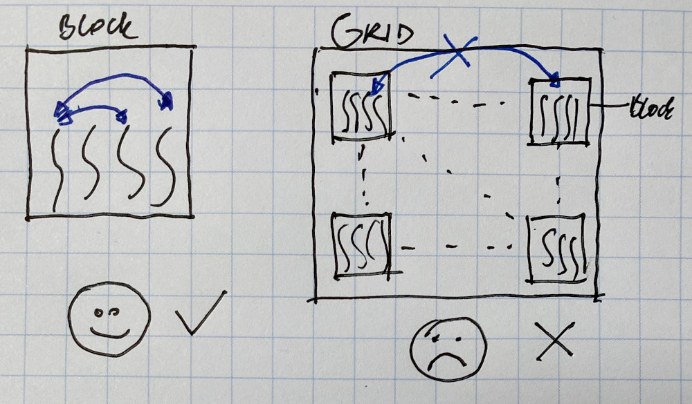
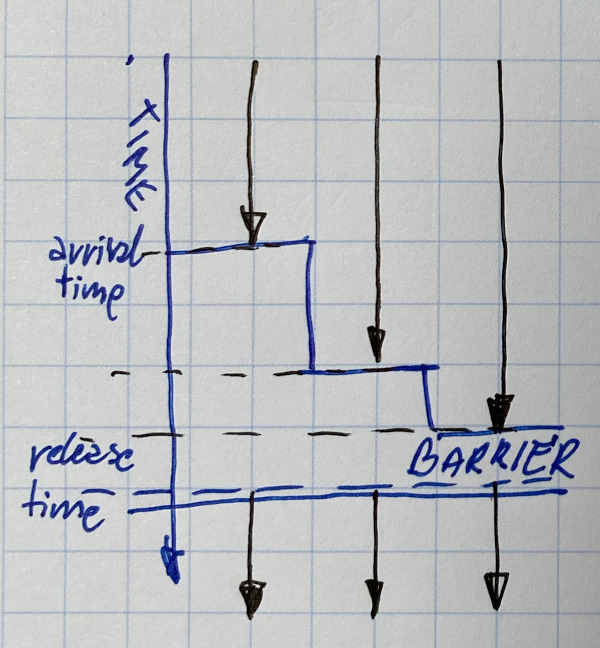

# Cooperation and synchronization

#### Thread cooperation


90% of bugs, are due to:


Threads within a block can synchronise

A thread cannot synchronise with threads in other blocks

#### Thread synchronisation

Within a block you can:

* exchange data vie shared memory \(or other\)
* synchronise threads: \_\_syncthreads\(\)

