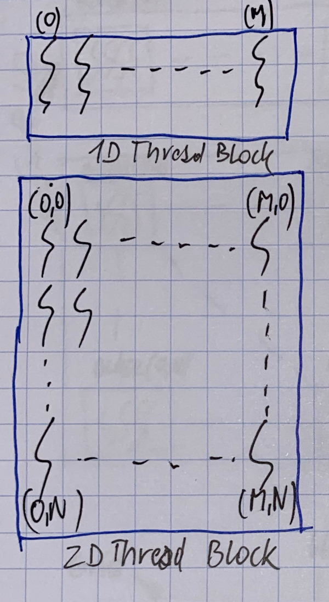
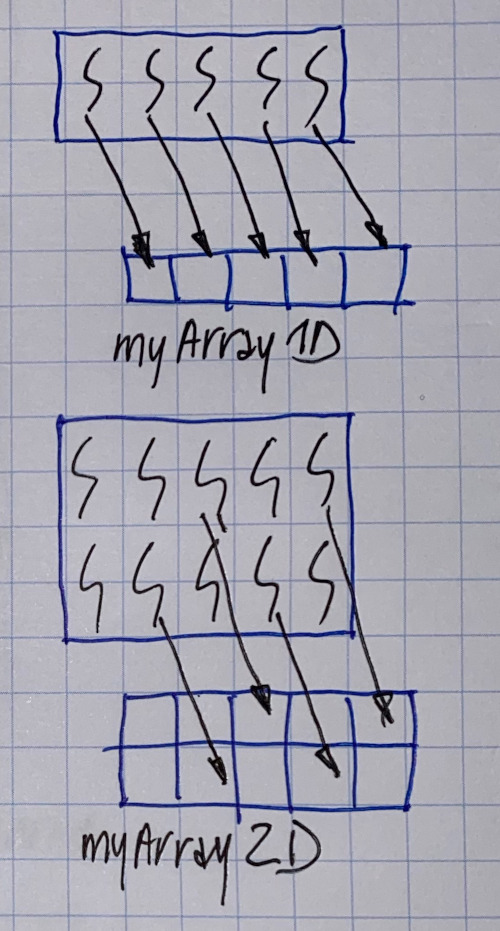

# Grids & blocks

### Grids and Blocks

Grids and Blocks are basic CUDA concepts, that permit to organise threads

They are created as kernel launch:

* grids are 1, 2, \(or 3\) dimensional array of blocks
* blocks are 1, 2, \(or 3\) dimensionale array of threads

A thread block is a batch of threads that can cooperate with each other by:

* synchronising their execution using barriers
* efficiently sharing data through a low latency shared memory

Two threads from two different blocks cannot cooperate

### Thread block organisation

Threads are grouped into blocks

Blocks can have 1, 2, or 3 dimensions

Each block dimension can have a maximum number of threads \(e.g. 512, 1024\)

#### Thread block

Block shape doesn't matter, but may be usefull for mapping threads to data

Or mapping nested loops in the original code: each 2D-organised thread taking care of an \(i,j\) pair:

#### Block organisation

Threads are grouped into blocks

Blocks are organised in a grid

A grid can be 1D, 2D \(or 3D\)

