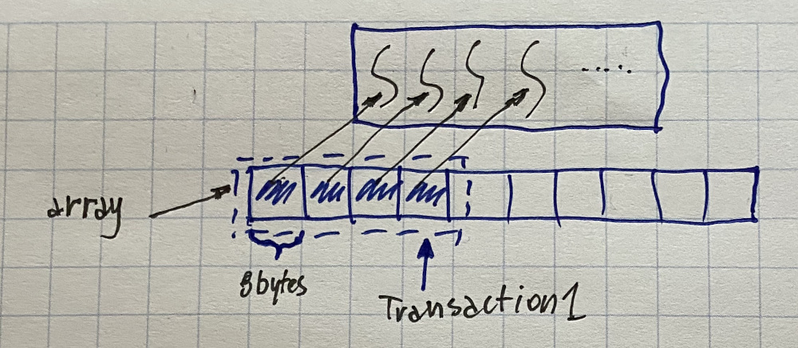
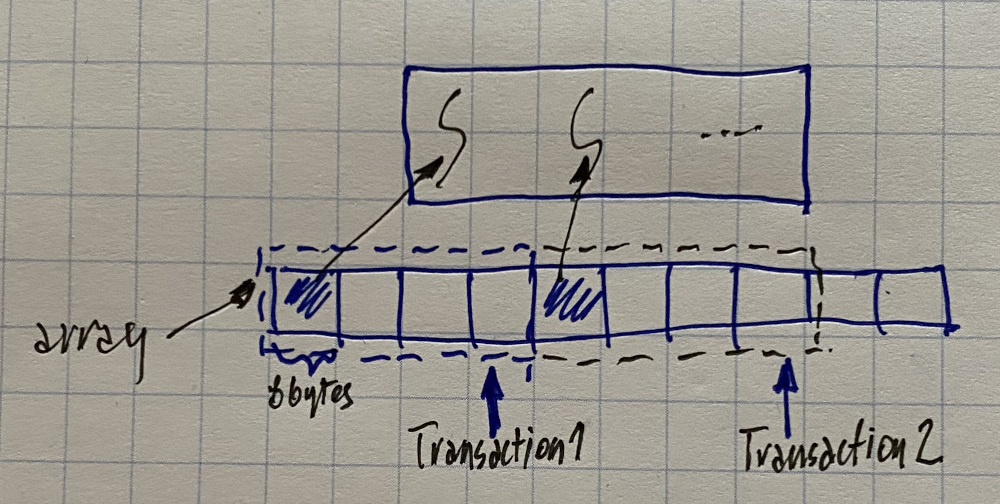
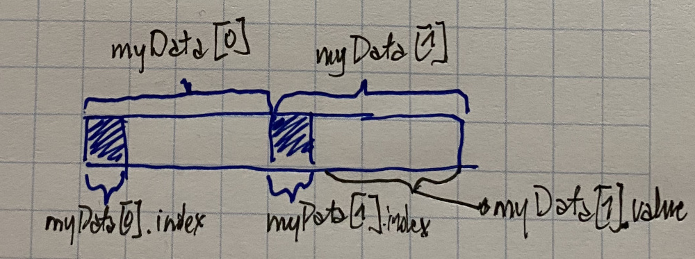
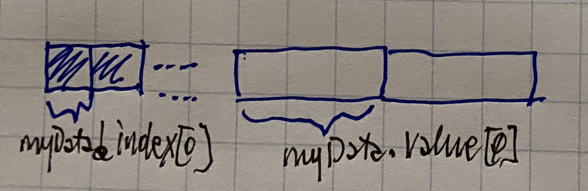

# Device memory access & conflicts

The way memory is accessed is critical for performance


### Global memory - coalescing access

Global memory - accessed via 32-, 64-, or 128- byte transactions.

Accesses can be coalesced - threads in the same warp access contiguous data

If coalesced - can perform several global memory accesses in a single transaction.

If not coalesced - may have to perform several long latency transactions =&gt; wasteful.


```c
//kernel code:
couble result = array[...];
```




Illustration only - actual behavior depends on compute capability, memory alignment ...



#### Global memory - uncoalesced access


```c
//kernel code:
couble result = array[...];
```




Illustration only - actual behavior depends on compute capability, memory alignment ...



#### Uncoalesced access - array of structures


```c
//on host:
typedef struct data{
    int index;
    double value;
}

data *myData;

cudaMalloc((void **) &myData, numVals * sizeof(data));

...


//in kernel:
idx = blockDim.x * blockIdx.x + threadIdx.x;
int a = myData[idx].index;
double b = mydata[idx].value;


```




Kills performance



#### Coalesced access - structure of arrays


```c
//on host:
typedef struct data{
    int index;
    double value;
}

data *myData;

cudaMalloc((void **) &myData.index, numVals * sizeof(int));
cudaMalloc((void **) &myData.value, numVals * sizeof(double));

...


//in kernel:
idx = blockDim.x * blockIdx.x + threadIdx.x;
int a = myData.index[idx];
double b = mydata.value[idx];


```




### Shared memory - banks & conflicts

Shared memory is organised into banks:

* 16 banks for CC 1.x
* 32 banks for CC 2.x

Successive 32-bit words assigned to successive banks

`__shared__ float shared[64];`


Memory access conflicts don't occur if:

* all threads in the same \(half-\) warp read different banks
* all threads in the same \(half-\) warp access the same data in a single bank \(broadcast\)

Memory access conflicts do occur if multiple threads \(but not all\) in the same \(half-\) warp access the same bank =&gt; serialized access


\[conflict image\]


### Memory alignment 

From programmers guide:

> Any access to a variable in global memory compiles to a single instruction if and only if:
>
> 1. The size of the data type is 1,2,4,8, or 16 bytes
> 2. The data is naturally aligned \(its adress is a multiple of its size\)

\[img memory alignmet example\]


?? Matrix transpose


#### Short vector types

Array of multi-element data structures?

* sequential access pattern uses multiple times the necessary bandwidth
* short vector types don't waste bandwidth, and use one instruction to load multiple elements: int2, char4, etc
* it is possible to create your own short-vector types


#### Memory dangers

* Need to maintain alignment when reading, non-naturally aligned 8-byte or 16-byte words
* 2D Array: BaseAddress + width \* ty + tx
* WIdth of thread block & width of array - multiple of the warp size \(1/2 warrp is 1.x compute\)
* cudaMallocPitch\(\) adds the correct padding to improve access efficiency

#### Dealing with memory in CUDA

Minimize memory transfers - even if it includes doing inefficient calculations od the device

Coalesce all memory access

Favour shared memory access to global memory access

Avoid code execution branching within a single warp as this serializes the threads


#### Optimising memory throughput

Minimise data transfers between the host and the device

Minimise data transfers between global memory and the device by maximising use of on-chip memory \(shared memory & caches\)

Maximise optimal memory access patterns

\[img\]


