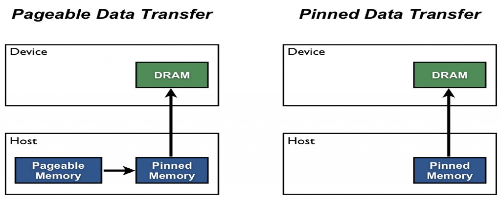

# Global memory - pinned/unpinned

Goals

Framework

Algorithms

On-the-fly parametrisation

**Pinned Host Memory**

Host \(CPU\) data allocations are pageable by default. The GPU cannot access data directly from pageable host memory, so when a data transfer from pageable host memory to device memory is invoked, the CUDA driver must first allocate a temporary page-locked, or“pinned”, host array, copy the host data to the pinned array, and then transfer the data from the pinned array to device memory, as illustrated below.

As you can see in the figure, pinned memory is used as a staging area for transfers from the device to the host. We can avoid the cost of the transfer between pageable and pinned host arrays by directly allocating our host arrays in pinned memory. Allocate pinned host memory in CUDA C/C++ using[cudaMallocHost\(\)](http://docs.nvidia.com/cuda/cuda-runtime-api/index.html#group__CUDART__MEMORY_1g9f93d9600f4504e0d637ceb43c91ebad)or[cudaHostAlloc\(\)](http://docs.nvidia.com/cuda/cuda-runtime-api/index.html#group__CUDART__MEMORY_1g15a3871f15f8c38f5b7190946845758c), and deallocate it with[cudaFreeHost\(\)](http://docs.nvidia.com/cuda/cuda-runtime-api/index.html#group__CUDART__MEMORY_1gedaeb2708ad3f74d5b417ee1874ec84a). It is possible for pinned memory allocation to fail, so you should always check for errors. The following code excerpt demonstrates allocation of pinned memory with error checking.

cudaError\_tstatus=cudaMallocHost\(\(void\*\*\)&h\_aPinned,bytes\);

if\(status!=cudaSuccess\)

printf\("Error allocating pinned host memoryn"\);

Data transfers using host pinned memory use the same[cudaMemcpy\(\)](http://docs.nvidia.com/cuda/cuda-runtime-api/index.html#group__CUDART__MEMORY_1g48efa06b81cc031b2aa6fdc2e9930741)syntax as transfers with pageable memory. We can use the following“bandwidthtest”program \([also available on Github](https://github.com/parallel-forall/code-samples/blob/master/series/cuda-cpp/optimize-data-transfers/bandwidthtest.cu)\) to compare pageable and pinned transfer rates.

\#include&lt;stdio.h&gt;

\#include&lt;assert.h&gt;

// Convenience function for checking CUDA runtime API results

// can be wrapped around any runtime API call. No-op in release builds.

inline

cudaError\_tcheckCuda\(cudaError\_tresult\)

{

\#if defined\(DEBUG\) \|\| defined\(\_DEBUG\)

if\(result!=cudaSuccess\){

fprintf\(stderr,"CUDA Runtime Error: %sn",

cudaGetErrorString\(result\)\);

assert\(result==cudaSuccess\);

}

\#endif

returnresult;

}

voidprofileCopies\(float\*h\_a,

float\*h\_b,

float\*d,

unsignedint n,

char\*desc\)

{

printf\("n%s transfersn",desc\);

unsignedintbytes=n\*sizeof\(float\);

// events for timing

cudaEvent\_tstartEvent,stopEvent;

checkCuda\(cudaEventCreate\(&startEvent\)\);

checkCuda\(cudaEventCreate\(&stopEvent\)\);

checkCuda\(cudaEventRecord\(startEvent,0\)\);

checkCuda\(cudaMemcpy\(d,h\_a,bytes,cudaMemcpyHostToDevice\)\);

checkCuda\(cudaEventRecord\(stopEvent,0\)\);

checkCuda\(cudaEventSynchronize\(stopEvent\)\);

floattime;

checkCuda\(cudaEventElapsedTime\(&time,startEvent,stopEvent\)\);

printf\(" Host to Device bandwidth \(GB/s\): %fn",bytes\*1e-6/time\);

checkCuda\(cudaEventRecord\(startEvent,0\)\);

checkCuda\(cudaMemcpy\(h\_b,d,bytes,cudaMemcpyDeviceToHost\)\);

checkCuda\(cudaEventRecord\(stopEvent,0\)\);

checkCuda\(cudaEventSynchronize\(stopEvent\)\);

checkCuda\(cudaEventElapsedTime\(&time,startEvent,stopEvent\)\);

printf\(" Device to Host bandwidth \(GB/s\): %fn",bytes\*1e-6/time\);

for\(inti=0;i&lt;n;++i\){

if\(h\_a\[i\]!=h\_b\[i\]\){

printf\("\*\*\* %s transfers failed \*\*\*",desc\);

break;

}

}

// clean up events

checkCuda\(cudaEventDestroy\(startEvent\)\);

checkCuda\(cudaEventDestroy\(stopEvent\)\);

}

intmain\(\)

{

unsignedintnElements=4\*1024\*1024;

constunsignedintbytes=nElements\*sizeof\(float\);

// host arrays

float\*h\_aPageable,\*h\_bPageable;

float\*h\_aPinned,\*h\_bPinned;

// device array

float\*d\_a;

// allocate and initialize

h\_aPageable=\(float\*\)malloc\(bytes\);// host pageable

h\_bPageable=\(float\*\)malloc\(bytes\);// host pageable

checkCuda\(cudaMallocHost\(\(void\*\*\)&h\_aPinned,bytes\)\);// host pinned

checkCuda\(cudaMallocHost\(\(void\*\*\)&h\_bPinned,bytes\)\);// host pinned

checkCuda\(cudaMalloc\(\(void\*\*\)&d\_a,bytes\)\);// device

for\(inti=0;i&lt;nElements;++i\)h\_aPageable\[i\]=i;

memcpy\(h\_aPinned,h\_aPageable,bytes\);

memset\(h\_bPageable,0,bytes\);

memset\(h\_bPinned,0,bytes\);

// output device info and transfer size

cudaDeviceProp prop;

checkCuda\(cudaGetDeviceProperties\(&prop,0\)\);

printf\("nDevice: %sn",prop.name\);

printf\("Transfer size \(MB\): %dn",bytes/\(1024\*1024\)\);

// perform copies and report bandwidth

profileCopies\(h\_aPageable,h\_bPageable,d\_a,nElements,"Pageable"\);

profileCopies\(h\_aPinned,h\_bPinned,d\_a,nElements,"Pinned"\);

printf\("n"\);

// cleanup

cudaFree\(d\_a\);

cudaFreeHost\(h\_aPinned\);

cudaFreeHost\(h\_bPinned\);

free\(h\_aPageable\);

free\(h\_bPageable\);

return0;

}

The data transfer rate can depend on the type of host system \(motherboard, CPU, and chipset\) as well as the GPU. On my laptop which has an Intel Core i7-2620M CPU \(2.7GHz, 2 Sandy Bridge cores, 4MB L3 Cache\) and an NVIDIA NVS 4200M GPU \(1 Fermi SM, Compute Capability 2.1, PCI-e Gen2 x16\), runningBandwidthTestproduces the following results. As you can see, pinned transfers are more than twice as fast as pageable transfers.

Device: NVS 4200M

Transfer size \(MB\): 16

Pageable transfers

Host to Device bandwidth \(GB/s\): 2.308439

Device to Host bandwidth \(GB/s\): 2.316220

Pinned transfers

Host to Device bandwidth \(GB/s\): 5.774224

Device to Host bandwidth \(GB/s\): 5.958834

On my desktop PC with a much faster Intel Core i7-3930K CPU \(3.2 GHz, 6 Sandy Bridge cores, 12MB L3 Cache\) and an NVIDIA GeForce GTX 680 GPU \(8 Kepler SMs, Compute Capability 3.0\) we see much faster pageable transfers, as the following output shows. This is presumably because the faster CPU \(and chipset\) reduces the host-side memory copy cost.

Device: GeForce GTX 680

Transfer size \(MB\): 16

Pageable transfers

Host to Device bandwidth \(GB/s\): 5.368503

Device to Host bandwidth \(GB/s\): 5.627219

Pinned transfers

Host to Device bandwidth \(GB/s\): 6.186581

Device to Host bandwidth \(GB/s\): 6.670246

You should not over-allocate pinned memory. Doing socan reduce overall system performance because it reduces the amount of physical memory available to the operating system and other programs. How much is too much is difficult to tell in advance, so as with all optimizations, test your applications and the systems they run on for optimal performance parameters.

**Batching Small Transfers**

Due to the overhead associated with each transfer, it is preferable to batch many small transfers together into a single transfer. This is easy to do by using a temporary array, preferably pinned, and packing it with the data to be transferred.

For two-dimensional array transfers, you can use[cudaMemcpy2D\(\)](http://docs.nvidia.com/cuda/cuda-runtime-api/index.html#group__CUDART__MEMORY_1g17f3a55e8c9aef5f90b67cdf22851375).

cudaMemcpy2D\(dest,dest\_pitch,src,src\_pitch,w,h,cudaMemcpyHostToDevice\)

The arguments here are a pointer to the first destination element and the pitch of the destination array, a pointer to the first source element and pitch of the source array, the width and height of the submatrix to transfer, and the memcpy kind. There is also a[cudaMemcpy3D\(\)](http://docs.nvidia.com/cuda/cuda-runtime-api/index.html#group__CUDART__MEMORY_1gc1372614eb614f4689fbb82b4692d30a)function for transfers of rank three array sections.

