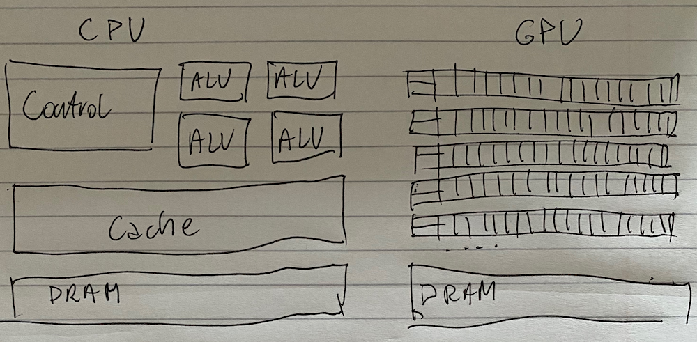
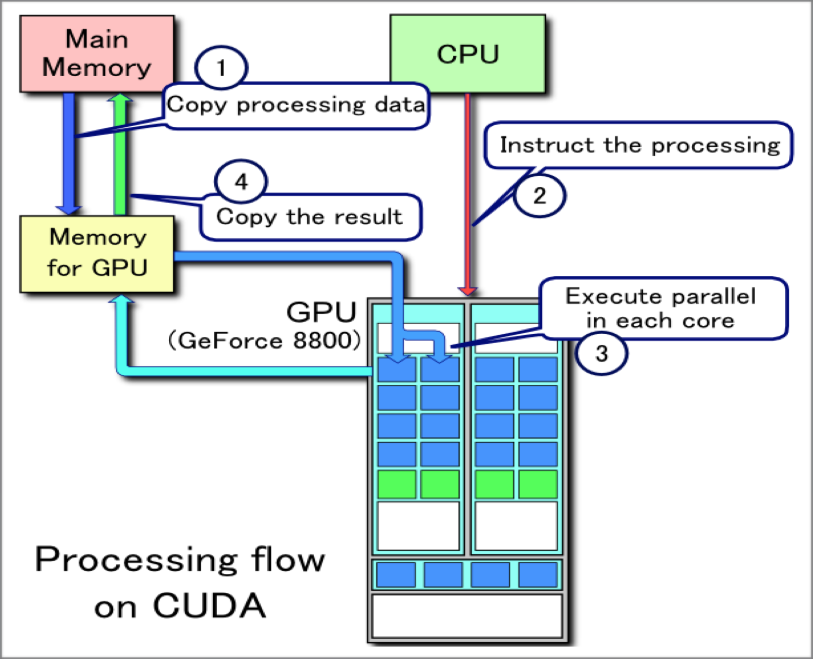
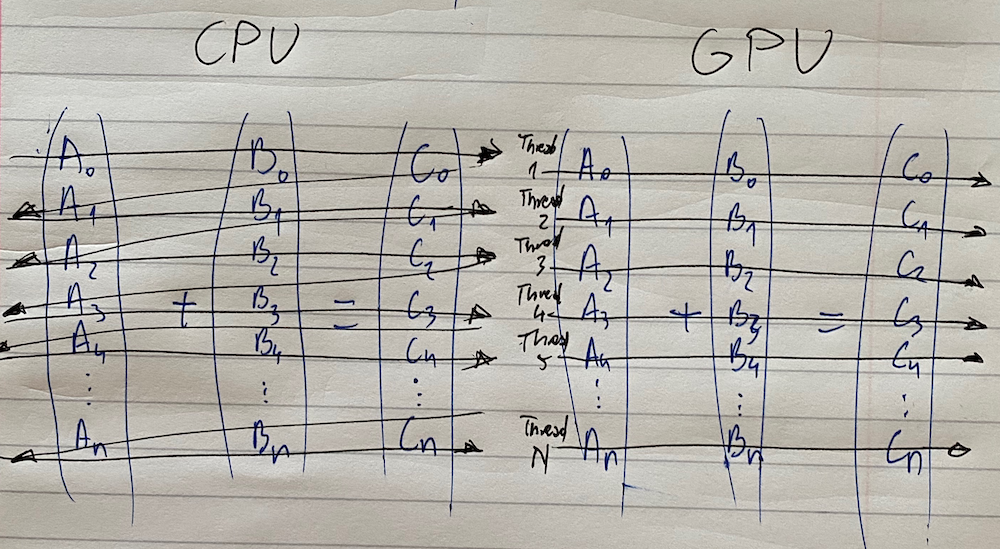

# Introduction

## What is GPU / GPGPUs?

General-Purpose computation on Graphics Processing Units.

GPUs are high-performance many-core processors that can be used to accelerate a wide range of applications.

Co-processor within the host computer

Not seen as a graphics card but as a huge computational power in a device of a small size 

#### A perfect storm of opportunities and technology

Multi-threaded software is a must-have because manufacturers were forced to move to multi-core CPUs: the failure of Dennard's scaling laws meant processor manufacturers had to add cores to increase performance and entice customers. 

Multi-core is disruptive to single-threaded legacy apps - businesses and research efforts will not benefit from new hardware unless they invest in multi-threaded software. Lack of investment risks stagnation and losing to the competition.

Competition is fierce, the new technology is readily available and it is inexpensive!

#### Why Massively Parallel Processing?

* Silent revolution
* Calculation: TFLOPS vs 100GFLOPS
* Memory bandwidth: ~10x
* a GPU in every PC

## What is CUDA?

CUDA stands for Compute Unified Device Architecture, it is a parallel computing platform and programming model created by NVIDIA and implemented by the graphics processing units \(GPUs\) that they produce. CUDA gives developers direct access to the virtual instruction set and memory of the parallel computational elements in CUDA GPUs.

First introduced in February 2007, CUDA is now taught at over 400 universities and academic institutions worldwide. NVIDIA estimates there is already an installed base of over 350 million CUDA-enabled GPGPUs

### What is difference between CPU and GPU?

Using CUDA, the GPUs can be used for general purpose processing \(i.e., not exclusively graphics\); this approach is known as GPGPU. Unlike CPUs, however, GPUs have a parallel throughput architecture that emphasizes executing many concurrent threads slowly, rather than executing a single thread very quickly.

CUDA has several advantages over traditional general-purpose computation on GPUs \(GPGPU\) using graphics APIs:

* Scattered reads–code can read from arbitrary addresses in memory
* Unified virtual memory \(CUDA 4.0 and above\)
* Unified memory \(CUDA 6.0 and above\)
* Shared memory–CUDA exposes a fast shared memory region \(up to 48 KB per multi-processor\) that can be shared amongst threads. This can be used as a user-managed cache, enabling higher bandwidth than is possible using texture lookups.
* Faster downloads and readbacks to and from the GPU
* Full support for integer and bitwise operations, including integer texture lookups

#### Limitations

* CUDA does not support the full C standard, as it runs host code through a C++ compiler, which makes some valid C \(but invalid C++\) code fail to compile.
* Interoperability with rendering languages such as OpenGL is one-way, with access to OpenGL having access to registered CUDA memory but CUDA not having access to OpenGL memory.
* Copying between host and device memory may incur a performance hit due to system bus bandwidth and latency \(this can be partly alleviated with asynchronous memory transfers, handled by the GPU's DMA engine\)
* Threads should be running in groups of at least 32 for best performance, with total number of threads numbering in the thousands. Branches in the program code do not affect performance significantly, provided that each of 32 threads takes the same execution path; the SIMD execution model becomes a significant limitation for any inherently divergent task \(e.g. traversing a space partitioning data structure during ray tracing\).
* Unlike OpenCL, CUDA-enabled GPUs are only available from Nvidia
* No emulator or fallback functionality is available for modern revisions
* Valid C/C++ may sometimes be flagged and prevent compilation due to optimization techniques the compiler is required to employ to use limited resources.
* A single process must run spread across multiple disjoint memory spaces, unlike other C language runtime environments.
* C++ Run-Time Type Information \(RTTI\) is not supported in CUDA code, due to lack of support in the underlying hardware.
* Exception handling is not supported in CUDA code due to performance overhead that would be incurred by across many thousands of parallel threads running.
* CUDA \(with compute capability 2.x\) allows a subset of C++ class functionality, for example member functions may not be virtual \(this restriction will be removed in some future release\). \[See CUDA C Programming Guide 3.1–Appendix D.6\]
* In single precision on first generation CUDA compute capability 1.x devices, denormal numbers are not supported and are instead flushed to zero, and the precisions of the division and square root operations are slightly lower than IEEE 754-compliant single precision math. Devices that support compute capability 2.0 and above support denormal numbers, and the division and square root operations are IEEE 754 compliant by default. However, users can obtain the previous faster gaming-grade math of compute capability 1.x devices if desired by setting compiler flags to disable accurate divisions, disable accurate square roots, and enable flushing denormal numbers to zero.

_GPUs have evolved to the point where many real-world applications are easily implemented on them and run significantly faster than on multi-core systems. Future computing architectures will be hybrid systems with parallel-core GPUs working in tandem with multi-core CPUs._

\_\_


_There was several projects in the past porting CUDA to different platforms._

* SWAN - CUDA to OpenlCL translation
* Ocelot - PTX to x86 emulation and translation

They are no longer supported.


\_\_

#### GPGPU -- historically

General Purpose computation using GPU and graphics API in applications other than 3D graphics \( GPU accelerates critical path of application\)

Data parallel algorithms leverage GPU attributes:

* large date arrays, streaming throughput
* fine-grain SIMD parallelism
* low-latency floating point \(FP\)computation

Applications:

* game effects \(FX\) physics, image processing
* physical modeling, computational engineering, matrix algebra, convolution, correlation, sorting 

#### Why computing on GPUs?

Incredibly powerful architecture \(peak performance over x TFlops\)

Continuously improved \(price - commodity-driven market, density - power efficiency\)

Transparent scalability \(natively massively parallel, multi-GPU easy\)

Large eco-system: hardware, software, development tools\)

#### Amdahl's law

_The speed-up of a parallel program is limited by its sequential fraction._

Strong scaling limited 

#### Gustafson's law

_The speed-up of a parallel program allows to tackle effectively larger problems in a given time frame._

Weak s scaling opened

#### Toollbox

Lots of code is already ported - all fields of science covered, typical speed-ups from a few X to 100+X

Accelerated libraries available: linear algebra, FFT, RNG, ..., template libraries

Development tools - compiler, debugger, IDE from NVIDIA and 3rd party ISVs

\_\_

