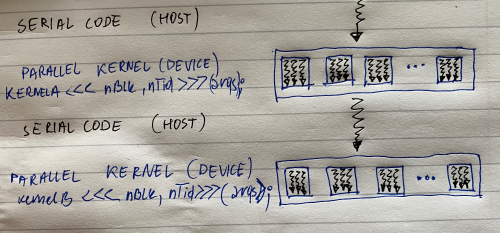
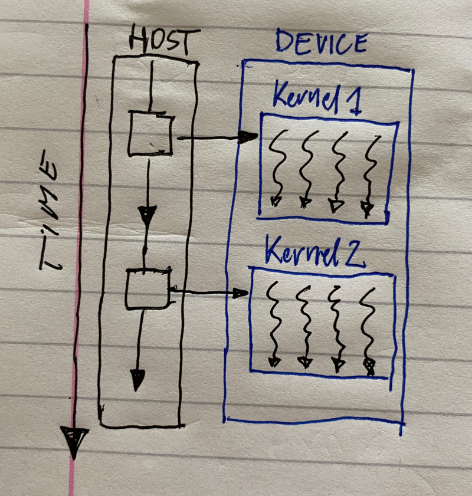
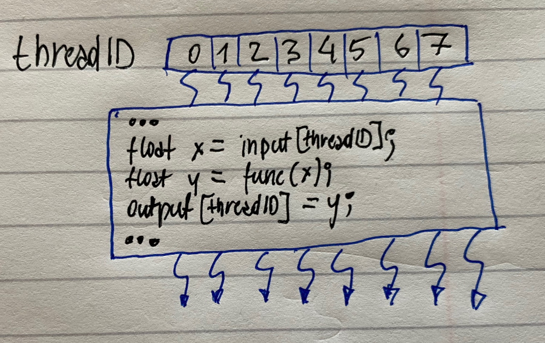

# CUDA

NVIDIA compute architecture

Quickly maturing software development capability provided free of charge by NVIDIA

C and C++ programming language extension the simplifies creation of efficient applications for CUDA-enabled GPUs.

#### CUDA - the essentials

General-purpose programming model

* user kick offs batches of threads on the GPU
* GPU = dedicated super-threaded, massively data parallel co-processoe

Target software stack

* compute-oriented drivers, language, and tools

Driver for loading computation programs into GPU

* standalone driver - optimised for computation
* interface designed for compute - graphics-free API
* data sharing with OpenGL buffer objects
* guaranteed maximum download and read-back speeds
* explicit GPU memory management

#### Essentials

* A better "SIMD" architecture: SIMD + branching, greatly improves programmability
* Best performance when a similar operation is used across a large datset
* C or C++ with small amounts of additional syntax to run parallel functions or ."kernels"

#### SIMT Architecture

"Single-Instruction, Multiple-Thread"

Thread-level parallelism via hardware multithreading with instruction-parallelism via pipelining \(sequential execution, no branch prediction, no speculative execution\)

Warp = 32 threads, one instruction at a time, full efficiency, same execution path of all 32

Data-dependent conditional branch - serial execution

#### CUDA - C with no shader limitations!

Integrated host + device app C program

* serial or modestly parallel parts in host C code
* highly parallel parts in device SPMD kernel C code

SPMD - Single-Program Multiple-Data

CUDA integrated CPU + GPU application C program:

* serial C code executes on CPU
* parallel kernel C code executes on GPU thread blocks

#### CUDA devices and threads

A compute device:

* is a co-processor to the CPU or host
* has its own DRAM - device memory
* runs many threads in parallel
* is typically a GPU but can also be another type of parallel processing device

Data-parallel portions of an application are expressed as device kernels which run on many threads

Differences between GPU and CPU threads:

* GPU threads are extremely lightweight - very little creation overhead
* GPU needs 1000s of threads for full efficiency - multi-core CPUs needs only a few

#### CUDA threads

CUDA 'kernels' are executed by many threads in parallel

Each thread executes the same code

threads are lightweight - very little overhead

#### Arrays of parallel threads

A CUDA kernel is executed ba an array of threads

* all threads run the same code \(SPMD\)
* each thread has an ID that it uses to compute memory addresses and make control decisions

CUDA - memory model overview

Global memory:

* main means of communicating R/W data between host and device
* contents visible to all threads
* long latency access

Constant memory

* todo!!

Texture memory

* todo!!!

 

