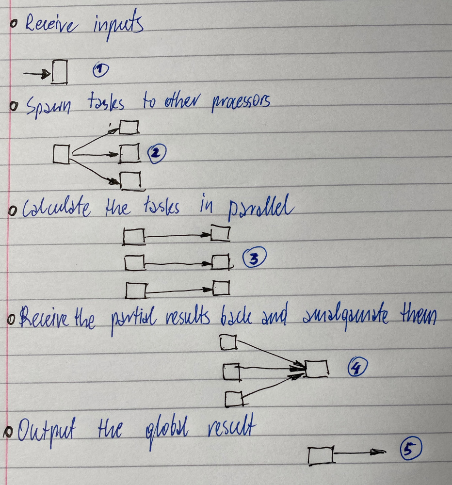

# Parallel algorithms

### Algorithm

A step-by-steo procedure that is guaranteed to terminate, such that each step is precisely stated and can be carried out by a computer:

* definiteness - each step is precisely stated
* effective computability - each step can be carried out by a computer
* finiteness - the procedure terminates

There are several algorithms that can be employed to solve the same problem:

* some require more or less steps
* some demand more or less processing time
* some have smaller or larger memory footprint
* some exhibit more or less parallelism than others

### The key steps towards parallelism

To take advantage of a parallel environment, it is required that a serial algorithm:

* be parallelised - identify lack of dependencies between statements in a serial algorithm and adapt its structure
* be substituted by a parallel one - design a parallel algorithm to perfomr the same task

It is natural that an algorithm be composed a sequence of sub-algorithms

The parallel nature of an environment can still be exploited even when no alternative to a serial algorithm exists, but its sub-algorithms can be parallelised or parallel slternatives to them exist!

Parallel algorithms are algorithms that can be executed simultaneously on multiple processors at a time

### Structure of parallel algorithms

Parallel algorithms are still algorithms, i.e. they still calculate a function and yield a result

The result is outputted by a single processor

The intermediate steps of an algorithm may be parallel , but its entry and exit point are still necessarily sequential

1. recieve inputs
2. spawn tasks to other processors
3. calculate the tasks in parallel
4. receive the partial results back and amalgamate them
5. output the global result

### Choosing an algorithm structure

