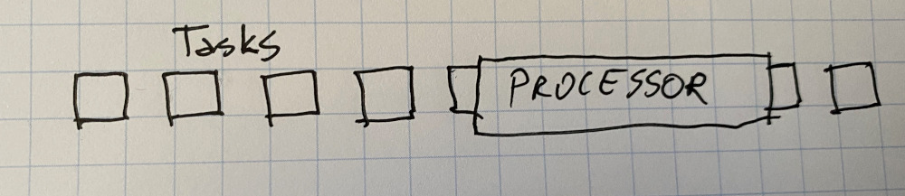
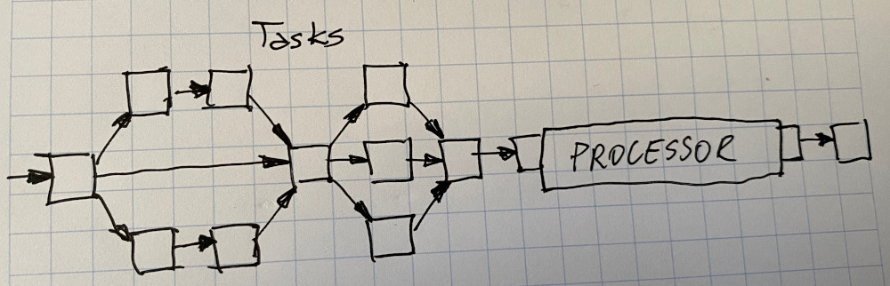
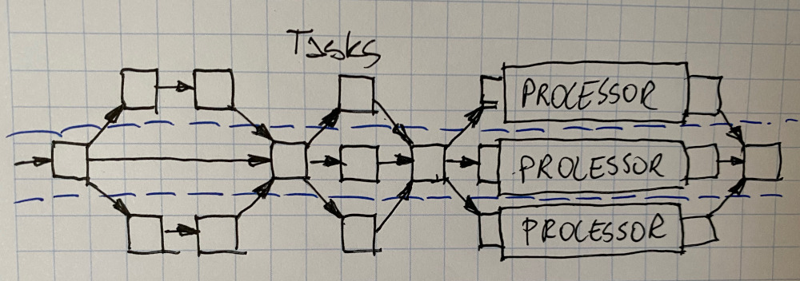
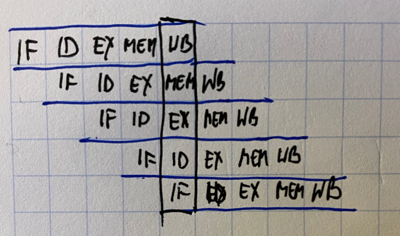

# Parallel computing

### Classical computing paradigm: serial computing


Calculations are performed in sequence: one task at a time.

The workload is comprised of serial tasks, computed by a single processor.




What if we want to make things faster?

We can drop off some tasks or we can reduce the task size or employ a faster processor.

But ultimately the time consumed for computing depends on the sum of all times consumed by individual tasks.

But take a closer look at the workload:




We force calculations to be serialized

Dependencies among them are not purely sequential.

an example:

```c
int doSmth(int a, int b) {
    int c = a + b;
    int d = a * b;
    int e = c + d;
    int f = c * d;
    return e/f; 
}
```

What can we do =&gt; parallelise!

Independent tasks can be performed concurrently.

```c
int doSmth( int a, int b) {
    int c = a + b; && int d = a * b;
    int e = c + d; && int f = c * d;
    return e/f;
}
```


A paradigm shift: parallel computing

Calculations are carried out simultaneously

Large problems are divided into small pieces, each of which is solved concurrently



Universe in parallel not serial.

Many complex, interrelated events happening at the same time, yet within a sequence::

* planetery movements
* vehicle assembly line
* rush hour traffic
* queue to go to a concert
* tectonic plate drift
* ordering a burger at the drive thru

Historically parallel computing is used in High Perfromance Computing, to model many scientific and engineering problems:

* atmosphere, weather, earth, environment
* physical processes \(high pressure, particle movement, fusion\)
* geology, seismology
* chemistry and molecular dynamics
* biosciences and genetics
* circultry design, microelectronics
* mechanical engineering

Nowadays parallel computing is used in processing large amounts of data

* data management, data mining
* oil exploration
* medical imaging and diagnosis
* web search engines
* financial and economic modeling
* pharmaceutical design
* advanced graphics and virtual reality
* collaborative environments


Why use parallel computing? In theory more resources - less time to complete

* save time and money \(in time-constrained settings\)
* solve larger problems
* solve more problems
* achieve better solutions
* more resources in parallel: provide concurrenry - may use non-local resources
* many commodity processors in parallel instead of one expensive fast processor

Parallel computing:

* parallelism of memory: different pieces of data being dealt with \(served as input to calculations\)
* parallelism of execution path: different pieces of code being executed concurrently

Being parallel does not mean there is no communication. The computation can be concurrent, but the partial results have to be amalgamated in the end anyway!


### Flynn's taxonomy

One of the most widely used means for classifying computer architectures, proposed in 1966

|  | Single instruction | Multiple instruction |
| :--- | :--- | :--- |
| Single data | SISD | MISD |
| Multiple data | SIMD | MIMD |


### The taxonomy in hardware: bit-level parallelism

Roughly: the more bits a processor works with, the less instructions issued to perform an operation

Example: adding two 64-bit integers in a 32-bit word processor vs. 64-bit word processor


### The taxonomy in hardware: instruction-level parallelism

Instructions can be reordered and grouped

They are allowed to execute concurrently or partially overlapped; yet, this does not change the output.

Compiler identifies which instructions depend on each other so to schedule their execution in parallel.

Instruction pipelining: multiple instructions are partially overlapped




Superscalar execution:

* more than one instruction is executed during a single clock cycle
* use redundant functional units inside the processor \(e.g.: ALU, bit shifter, multiplier\)

Out-of-order execution:

* sequence of executed instructions is driven also by the availability of input data
* if an instruction stalls waiting for input \(e.g. read from memory\) another instruction is issued
* results are queued until the stalled instruction ends

Register naming:

* some instructions may depend on one another due to same registers being used
* in case the value stored is not used, the tasks can be made independent by renaming the registers

Speculative execuion: if resources are idle, run instructions that may not be needed

* prefetching in memory: load piece of data that is going to be used in a near future
* branch prediction: try to guess which branch will be executed before knowing for sure
* optimistic concurrency control: execute many instructions in parallel and only commit those which did not have its data modified by other instructions
* eager execution: execute both sides sides of a coditional branch and only commit those results depending on how the condition is elavated


### The taxonomy in software: data-level parallelism

Divide the input into independent pieces that can be processed simultaneously, example: two gardeners, each weeding and watering 1/2 of the garden.


### The taxonomy in software: task-level parallelism

Divide tasks into independent sub-tasks that can be performed simultaneously, example: two gardeners, one weeding and one waterin all the garden


