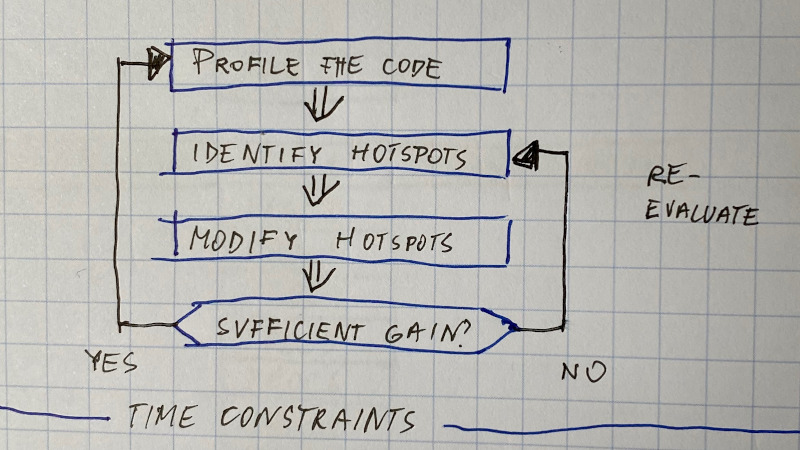
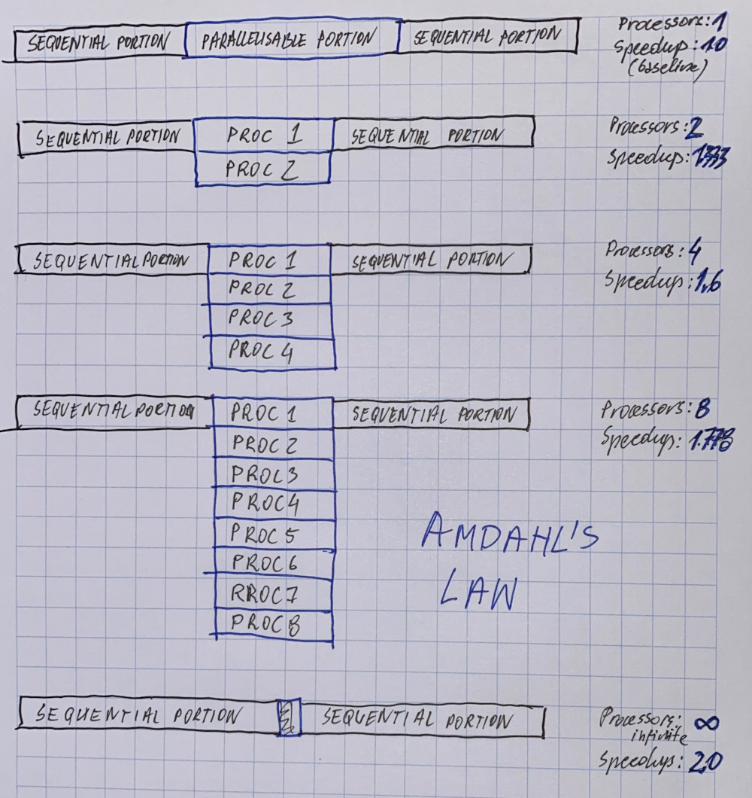
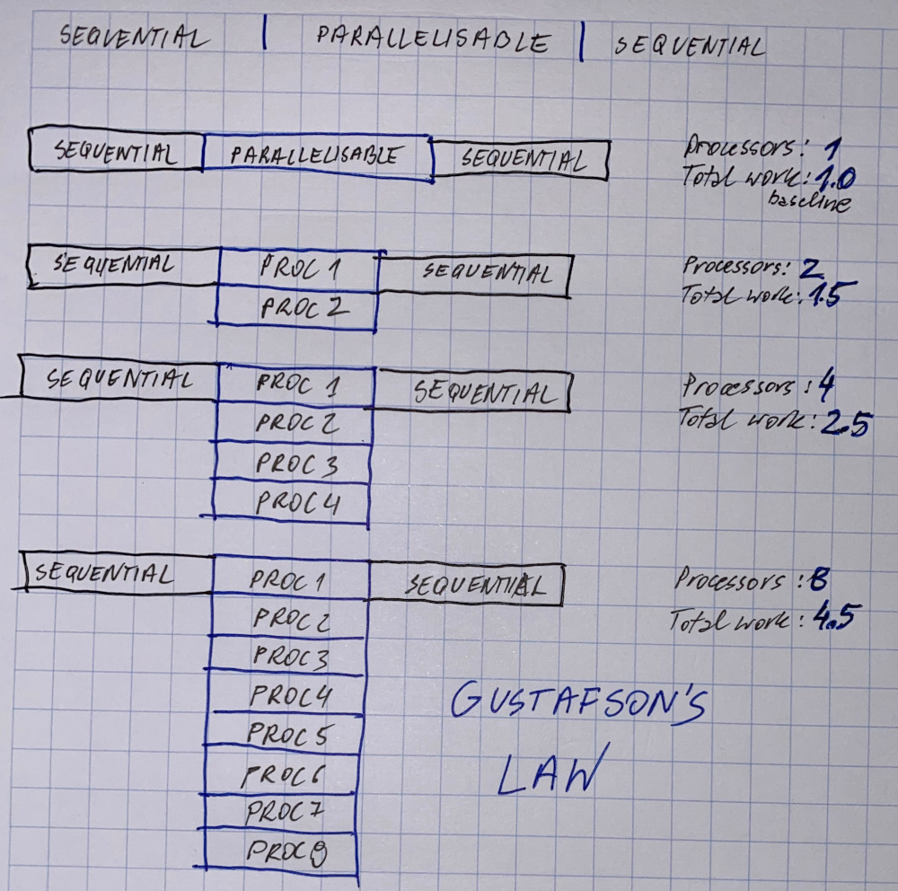

# Parallelisation and it's limits

Exploiting parallelism comes at a cost - try to pay the lowes price

### Embarrasingly parallel algorithms

Algorithms that solve many similar but independent tasks concurrently:

* little to no communication between processors
* almost no synchronisation points
* no data shared among the tasks
* commonly the load is well-balanced between the processors and the algorithm scales well

### Automatic parallelisation

Avoid the manual process of designing parallel solutions: time-consuming, complex, error-prone, iterative process

Employ tools to assist the process of converting serial solutions into parallel ones - parallelising compilers and pre-processors

Fully automatic - performs automatic code analysis, including identifying apportunities for parallelism and trade-off in terms of performanca

Programmer directed - the programmer inserts compiler directives or flags inside the code to tell the ccompiler how to parallelise it

### Hazards in automatic parallelisation:

* wrong results may be yielded
* performance mey degrade
* follows a fixed procedure, ie: it is less fexible
* usually limited to subset of the code \(e.g.: loops\)
* may be useless for very complex pieces of code

It may be solution in case of time or budget constrains!

### Parallel software optimisation

An interative process

Very time-consuming

Levels to be tracked:

* compiler issues
* libraries, frameworks
* code optimizaiton

### Limits to scalability

### Strong scaling - Amdahl's law:

* fixed total problem size
* time decreases when number of processors increases

### Waek scaling: Gustafson's law:

* fixed problem size per processor
* time ideally remains constant despite the number of processors

#### "If you build, they will come.."

> And so we built them. Multiprocessor workstations, massively parallel supercomputers, a cluster in every department... and they haven't come.
>
> Programmers haven't come to program these wonderful machines.
>
> The computer industry is ready to flood the market with hardware that will only run at full speed with parallel programs. But who will write these programs?

T. Mattson, B.Sanders, B. Massingill - "Patterns for parallel programming", 2005

