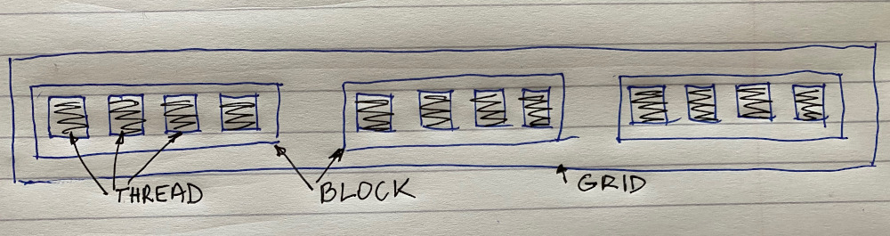

# CUDA programming model

### API - Application Programming Interface

The API is an extension to the C programming language.

It consists of:

* language extensions - to target portions of the code for execution on the device
* a runtime library, split into:

  * a common component providing built-in vector types and a subset of the C runtime library in both host and device codes
  * a host component to control and access one or more devices from the host
  * a device component providing device-specific functions

The API is an extension to the ANSI C programming language - low learning curve

The hardware is designed to enable lightweight runtime and driver - high performance


### Global memory: allocate, copy, free

```c
cudaError_t cudaMalloc(void **devPtr, size_t size)

cudaError_t cudaMemcpy(void *dst, const void *src, size_t count, enum cudaMemcpyKind kind)
//kind: cudaMemcpyHostToDevice, codaMemcpyDeviceToHost

cudaError_t cudaMemset(void *devPtr, int value, size_t count)

cudaError_t cudaFree(void *devPtr)

```


#### Device memory allocation

cudaMalloc\(\):

* allocates object in the device global memory
* requires 2 parameters:
  * address of a pointer to the allocated object
  * size of the allocated object

cudaFree\(\)

* frees object from device global memory 
* pointer to a freed object

Code example

* allocate a 64\*64 single-precision float array
* attach the allocated storage to Md
* "d" is often used to indicate a device data structure

```c
#define TILE 64

int main(int argc, char *arg[]) {
    float *Md = NULL;
    cudaMalloc( &Md, TILE * TILE * sizeof(int));
    // xxx
    cudaFree(Md);
    return 0;
}
```


#### Host-Device data transfer

cudaMemcpy\(\)

* memory data transfer
* requires four parameters:
  * pointer to destination
  * pointer to source
  * number of bytes copied
  * type of transfer
    * host to host
    * host to device
    * device to host
    * device to device
* asynchronous transfer

Code example:

* transfer a 64 \* 64 single-precision float array
* M is in host memory and Md is in device memory

```c
#define TILE 64

int main(int argc, char *argv[]) {
    
    float *Md = NULL, *M = NULL;
    size_t mem_size = TILE * TILE * sizeof(int);
    
    M = (float *) malloc(mem_size);
    cudaMalloc(&Md, mem_size);
    
    cudaMemcpy(Md, M, mem_size, cudaMemcpyHostToDevice);
    //xxx
    cudaMemcpy(M, Md, mem_size, cudaMemcpyDeviceToHost);
    
    cudaFree(Md);
    free(M);
    
    return 0;
}
```


### CUDA function declarations

| Example | Executed on the: | Only callable from the |
| :--- | :--- | :--- |
| \_\_device\_\_ float DeviceFunc\(\) | device | device |
| \_\_global\_\_ void KernelFunc\(\) | device | host |
| \_\_host\_\_ float HostFunc\(\) | host | host |


* \_\_host\_\_ is the default value and is overridden by other qualifiers
* \_\_global\_\_ defines kernel function and MUST return void
* \_\_device\_\_ and \_\_host\_\_ can be used together to define the same function to be called both host and device. The compiler generates two different versions for the same function

```c
__global__ void dist(double *x, double *y);
__device__ double dist(double *x, double*y);
__host__ double dist(double *x, double *y);
__host__ __device__ double dist(double *x, double *y);
```


### Kernel execution


Parallel code \(kernel\) is launched and executed on a device by many threads.

Threads are grouped into thread blocks.

Parallel code is written for a thread

* each thread is free to execute a unique code path
* built-in thread and block ID variables

Threads launched for a parallel section are partitioned in thread blocks: grid = all blocks for a given kernel execution.

Thread block is a group of threads that can:

* synchronize their execution
* communicate via shared memory


```c
myKernel<<< 3, 4 >>>(d_a);
```




Kernel launch is asynchronous: host doesn't wait for the kernel to finish - unless you tell it to do so

```c
cudaThreadDynchronise();
/* wait until device has finished before allowing host execution to proceed */
```


### Exercises

1. Array copy: arraSrc\_h -\[copy\]-&gt; arraySrc\_d =\[copy\]=&gt; arrayDest\_d -\[copy\]-&gt; arrayDest\_h  ==&gt; compare
2. Array reversal: host-&gt;device -\[xxxxx\(first with last\]-&gt;device-&gt; host-&gt; test \(multiblocks + error checking\)


> “The best way of learning about anything is by doing.” — Richard Branson

