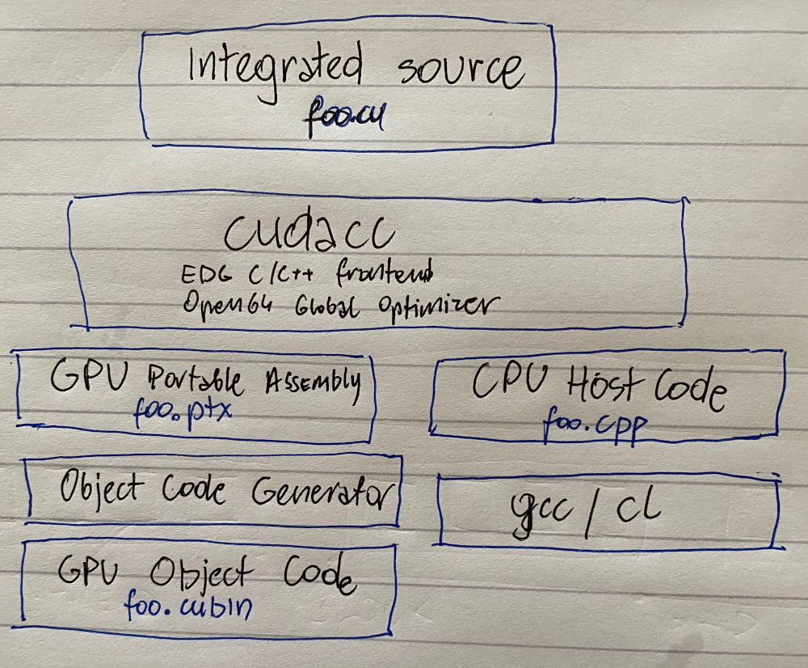

# Compilation - NVCC

Any source file containing CUDA language extensions must be compiled with NVCC

NVCC is a compiler driver - works by invoking all the necessary tools and compilers like cudacc, g++, cl, ...

NVCC outpus:

* C code \(host CPU code\) - must be compiled with the rest of the application using another tool
* PTX \(Parallel Thread eXecution\) - object code directly or PTX source - interpreted at runtime
* .cu code split: host \(gcc\) and device \(ptx/cubin\)
* cubin objects: executed by CUDA driver API directly, linked together with host executable and launches as kernels
* C++ code support: host - full; device - subset;
* 

