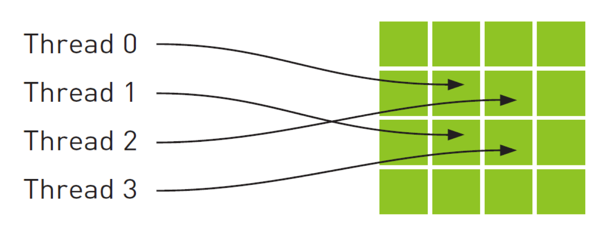
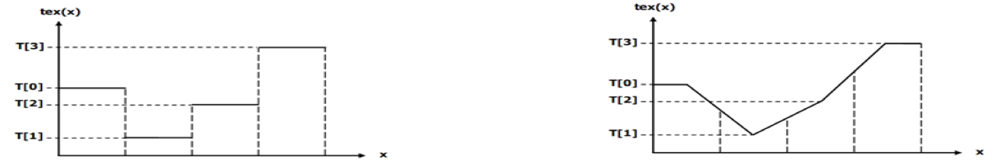

# Texture memory

What is difference between global memory and texture memory?




There is yet another type of read-only memory that is available for use in your programs written in CUDA C. Readers familiar with the workings of graphics hardware will not be surprised, but the GPU’s sophisticated texture memory may also be used for general-purpose computing. Although NVIDIA designed the texture units for the classical OpenGL and DirectX rendering pipelines, texture memory has some properties that make it extremely useful for computing.

Like constant memory, texture memory is cached on chip, so in some situations it will provide higher effective bandwidth by reducing memory requests to off-chip DRAM. Specifically, texture caches are designed for graphics applications where memory access patterns exhibit a great deal of spatial locality. In a computing application, this roughly implies that a thread is likely to read from an address“near”the address that nearby threads read, as shown in Figure

The read-only texture memory space is cached. Therefore, a texture fetch costs one device memory read only on a cache miss; otherwise, it just costs one read from the texture cache. The texture cache is optimized for 2D spatial locality, so threads of the same warp that read texture addresses that are close together will achieve best performance. Texture memory is also designed for streaming fetches with a constant latency; that is, a cache hit reduces DRAM bandwidth demand, but not fetch latency.

In certain addressing situations, reading device memory through texture fetching can be an advantageous alternative to reading device memory from global or constant memory.

Reading the Texture memory

The process of reading a texture is called a texture fetch. The first parameter of a texture fetch specifies an object called a texture reference.

A texture reference defines which part of texture memory is fetched. As detailed in Section 3.2.10.1.3 in CUDA programming guide 4.2; it must be bound through runtime functions to some region of memory, called a texture, before it can be used by a kernel. Several distinct texture references might be bound to the same texture or to textures that overlap in memory.

A texture reference has several attributes. One of them is its dimensionality that specifies whether the texture is addressed as a one-dimensional array using one texture coordinate, a two-dimensional array using two texture coordinates, or a three-dimensional array using three texture coordinates. Elements of the array are called texels, short for“texture elements.”The type of a Texel is restricted to the basic integer and single-precision floating-point types and any of the 1-, 2-, and 4-component vector types defined in Section B.3.1 in CUDA programming guide 4.2\).

Other attributes define the input and output data types of the texture fetch, as well as how the input coordinates are interpreted and what processing should be done.

A texture can be any region of linear memory or a CUDA array \(described in Section 3.2.10.2.3 in CUDA programming guide 4.2\). Table F-2 lists the maximum texture width, height, and depth depending on the compute capability of the device.

Textures can also be layered as described in Section 3.2.10.1.5. CUDA programming guide 4.2

A point to remember regarding Texture memory

Within a kernel call, the texture cache is not kept coherent with respect to global memory writes, so texture fetches from addresses that have been written via global stores in the same kernel call return undefined data. That is, a thread can safely read a memory location via texture if the location has been updated by a previous kernel call or memory copy, but not if it has been previously updated by the same thread or another thread within the same kernel call. This is relevant only when fetching from linear or pitch-linear memory because a kernel cannot write to CUDA arrays.


If textures are fetched using tex1D\(\), tex2D\(\), or tex3D\(\) rather than tex1Dfetch\(\), the hardware provides other capabilities that might be useful for some applications such as image processing,


Nice Texture Memory Features / Advantages of Texture memory in CUDA

I would like to discuss some basic features of texture memory before start looking how to use in your CUDA code. From NVidia, they provide some very awesome feature alongside it inherits some nice features from the graphics pipeline.

Feature of texture memory for programmer convince, here some of them,

Get some things for free:

* Linear interpolation of adjacent data values



* Automatic normalization of data when you fetch it
  * \[0,1\] for unsigned values
  * \[-1,1\] for signed values
* Automatic normalization of array indices to \[0,1\]
  * e.g. same code for all problem sizes
* Automatic boundary handling


Disadvantages of Texture memory in CUDA

Read-only

–Can only update 3D textures by performing a memcpy to some rectangular region of the texture

–However if your texture is 2D, you can write directly into it via a surface object \(go through CUDA programming guide 4.2 \)

When to Use Texture Memory in CUDA

•If you update your data rarely but read it often...

•…especially if there tends to be some kind of spatial locality to the read access pattern…

•i.e. nearby threads access nearby locations in the texture

•…and especially if the precise read access pattern is difficult to predict

•Also, you need to use texture memory in order to visualize your data using the graphics pipeline \(consult the CUDA SDK samples\)

When Not to Use Texture Memory in CUDA

We should not use texture memory when we read our input data exactly once after update it.

Example of texture memory in CUDA

For understanding example please go through the following function, which we are going to use in this example to demonstrate how to use texture memory in CUDA, functions are;

cudaBindTexture, cudaBindTexture2D, cudaBindTexture2D, cudaUnbindTexture

cudaBindTextureToArray, cudaCreateChannelDesc and Texture functions \(Texture object and Reference API\)

I have already explained that, the process of reading a texture is called a texture fetch. The first parameter of a texture fetch specifies an object called a texture reference. A texture reference defines which part of texture memory is fetched.

Steps of using Texture in Your CUDA code

Now we learn how to use texture memory in your CUDA C code. I’ll illustrate this step by step.

Overview of steps

·Declare the texture memory in CUDA.

·Bind the texture memory to your texture reference in CUDA.

·Read the texture memory from your texture reference in CUDA Kernel.

·Unbind the the texture memory from your texture reference in CUDA.

Reading texture memory from your texture reference in CUDA Kernel

When we’re reading from textures in the kernel, we need to use special functions to instruct the GPU to route our requests through the texture unit and not through standard global memory. As a result, we can no longer simply use square brackets to read from buffers; we need to modify kernel function to use

tex1Dfetch \(\) when reading from memory.

Additionally, there is another thing to be note in texture memory reading; since in all the previous posts under CUDA programming section we were using global memory to read data as either input or output. Now we need to change this scenario and use texture memory that requires us to make some other changes too. Although it looks like a function, tex1Dfetch \(\) is a compiler intrinsic. And since texture references must be declared globally at file scope, we can no longer pass the input and output buffers as parameters to our kernel function because the compiler needs to know at compile time which textures tex1Dfetch \(\) is should be sampling.

Rather than passing pointers to input and output buffers as we previously did in previous post’s in CUDA programming section, we will pass to kernel function a Boolean flag“indicator”that indicates which buffer to use as input and which to use as output.

Format of tex1Dfetch \(\)

Performance consideration of Texture memory

Texture memory can provide additional speedups if we utilize some of the conversions that texture samplers can perform automatically, such as unpacking packed data into separate variables or converting 8- and 16-bit integers to normalized floating-point numbers.

Basic change would look like :

On CUDA side:

move fingerprints from parameters to texture declaration:

`texture<float, 2, cudaReadModeElemntType> db;`

on Java side:

```java
// Create the array on the device
CUarray arrRscp = new CUarray();
CUDA_ARRAY_DESCRIPTOR ad = new CUDA_ARRAY_DESCRIPTOR();
ad.Format = CU_AD_FORMAT_FLOAT;
ad.Width = stationsDB.length;
ad.Height = 1;
ad.NumChannels = 1;
cuArrayCreate(arrRscp, ad);
// Copy the host input to the array
Pointer pInput = Pointer.to(input_float_1D);
cuMemcpyHtoA(arrRscp, 0, stationsDB, stationsDB.length * Sizeof.FLOAT);
// Set up the texture reference
CUtexref texref = new CUtexref();
cuModuleGetTexRef(texref, module, "db");
cuTexRefSetFilterMode(texref, CU_TR_FILTER_MODE_POINT);//LINEAR
cuTexRefSetAddressMode(texref, 0, CU_TR_ADDRESS_MODE_WRAP); //CLAMP
cuTexRefSetAddressMode(texref, 1, CU_TR_ADDRESS_MODE_WRAP);
cuTexRefSetFlags(texref, CU_TRSA_OVERRIDE_FORMAT);
cuTexRefSetFormat(texref, CU_AD_FORMAT_FLOAT, 1);
cuTexRefSetArray(texref, arrRscp, CU_TRSA_OVERRIDE_FORMAT);
```


However that will not work.

Reason is quite simple, maximum texture dimension size \(x,y,z\) is:

1D = 65536

2D = 65536 x 65536

3D = 4096 x 4096 x 4096

As we have 2 mln fingerprint is much over that size - and in our example we need 3 values for each fingerprint = 6 mln.

We can fix it in two ways:

* use 2D and split big array by some defined layer dimension \(divided by 3 as we have 3 elements\)
* use better grouping so we will have max 65536 stations each station could have max 65536/3 = 21846 fingerprints

NOTE: we could get advantage on CUDA automatic interpolation - more discussion about that later in advanced chapters.

Lets start with first solution:

1\)we need to define layer dimension

TEXTURE\_DIM = 3072;

Java code will change to:

```java
// Create the array on the device
CUarray arrRscp = new CUarray();
CUDA_ARRAY_DESCRIPTOR ad = new CUDA_ARRAY_DESCRIPTOR();
ad.Format = CU_AD_FORMAT_FLOAT;
ad.Width = TEXTURE_DIM;
ad.Height = parts;
ad.NumChannels = 1;
cuArrayCreate(arrRscp, ad);
// Copy the host input to the array
CUDA_MEMCPY2D copyHD = new CUDA_MEMCPY2D();
copyHD.srcMemoryType = CUmemorytype.CU_MEMORYTYPE_HOST;
copyHD.srcHost = Pointer.to(DB);
copyHD.srcPitch = TEXTURE_DIM * Sizeof.FLOAT;
copyHD.dstMemoryType = CUmemorytype.CU_MEMORYTYPE_ARRAY;
copyHD.dstArray = arrRscp;
copyHD.WidthInBytes = TEXTURE_DIM * Sizeof.FLOAT;
copyHD.Height = parts;
cuMemcpy2D(copyHD);
// Set up the texture reference
CUtexref texref = new CUtexref();
cuModuleGetTexRef(texref, module, "db");
cuTexRefSetFilterMode(texref, CU_TR_FILTER_MODE_POINT);//LINEAR
cuTexRefSetAddressMode(texref, 0, CU_TR_ADDRESS_MODE_WRAP); //CLAMP
cuTexRefSetAddressMode(texref, 1, CU_TR_ADDRESS_MODE_WRAP);
cuTexRefSetFlags(texref, CU_TRSA_OVERRIDE_FORMAT);
cuTexRefSetFormat(texref, CU_AD_FORMAT_FLOAT, 1);
cuTexRefSetArray(texref, arrRscp, CU_TRSA_OVERRIDE_FORMAT);
```


NOTE: cuTexRefSetFlags:CU\_TRSA\_OVERRIDE\_FORMATvsCU\_TRSF\_NORMALIZED\_COORDINATES

On CUDA side however we need to get proper values, so our code now will look like:

Output timings: 71.712ms = 1min 11sec 712ms.

Where we are: we get advantage of texture caching as in same time all processors are calling same texture area, but in same time we introduce another complexity to find out all 3 values: rscp, latitude, longitude.

So it’s even.


Let’s look into group by station solution:

Output: 1168ms = 1sec 168ms!

Where:

Texture created in: 781ms

Input values take: 177ms

Kernel calculations takes: 202ms

CUDA occupancy calculator:

We are using 3.0 \(no shared memory at the moment\),

512 threads per bloclk

23 registers

Our solution was using global memory, lets quick look into 2 other ones: constant and texture memory.

