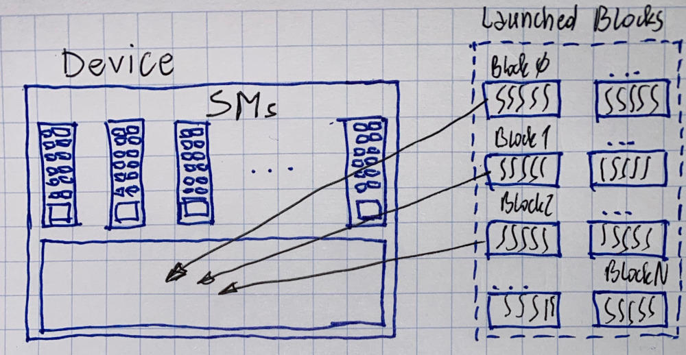

# Thread scheduling

### Scheduling - device level

Hardware allocates blocks to available SMs at it's discretion.




It allows up to 8 blocks per SM and block the remaining ones


Until they are processed


### Scheduling - SM level

Each block is partitioned into 32-thread batches called warps \(warp definition not part of CUDAA\).

Only one warp is executed on an SM at a time

Threadss within a warp run instruction in lock-steps

Warps are switched in/out of execution depending on the availability of instructions/compute resources

Warp switching has minimal overhead

This is how GPU performs latency hiding

​


### Thread divergence

Threads in a warp execute instructions in lock-step

If-else blocks based on thread ID can lead to thread divergence

```c
if (threadIdx.x < 16) {
// threads 0-15 execute, threadss 16-31 wait
} else {
// threads 0-15 wait, threads 16-31 execute
}
```


